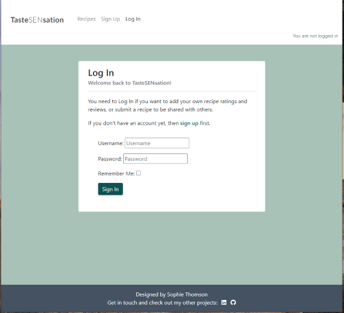

# TasteSENsation

[TasteSENsation](https://tastesensation-pp4-54d01fbc1628.herokuapp.com/) is a recipe site with curated recipes for budding chefs with Special Educational Needs (SEN).

Users are invited to sign up to rate and comment on the recipes so that other visitors to the site can see which recipes are popular. They can also suggest their own recipes to be added to the cookbook recipe list for others to enjoy.

The simple, uncluttered layout and use of additional visual prompts help to make the site easy to understand and navigate with minimal distractions. This means that SEN users are more likely to be able to use the site and follow the steps unaided.

## Features

### Site Wide

***Favicon***
- A favicon with a bold letter 'T' for TasteSENsation so it is easily identifiable among multiple tabs.

***Nav Bar***
- Navigation bar with clear brand heading for TasteSENsation. 
- SEN section of the brand title has different font weight and scale to stand out and reinforce message that this is a recipe site for people with Special Educational Needs (SEN). 
- Includes links for easy navigation around the site. Only links that are accordant with user role and authentication are displayed for better user experience.
- Fully responsive with navigation links collapsable into a burger 'Menu' icon on smaller devices to keep layout clean and uncluttered.
- Includes note to display log in status and username to the user at all times.

***Footer***
- Footer with dark background to frame bottom of html page.
- Includes information on the site designer and links to social media profiles.
- Links open in a new tab for better UK and include aria tags for better accessibility.
- Responsive format to look good on all devices.

***Alert Messages***
- Messages are displayed over the top of the screen to feedback confirmation to the user of certain actions throughout the site.
- Successful confirmation messages are displayed in green to highlight success of the action and provide useful feedback.
- Error messages are displayed in red to highlight that there is something wrong and attention or alternative action is required.
- JavaScript is used to make the messages automatically disappear after 5 seconds for better user experience.
- User can click on 'x' to close the message more quickly if they prefer.

### Recipes (index.html)

***Recipe List***
- Initially all published recipes are displayed, with each recipe featured in a 'recipe card' including:

   - The recipe title (name of the dish)
   - A recipe image
   - A 'You will use:' display of icons to represent the different equipment that the recipe requires
   - An average rating for the recipe represented by a visual representation of 5 star icons
   - An aria-label is used to ensure that the average rating is still available if the user uses a screen reader

***Recipe Detail (recipe_detail.html)***

***Feedback***

***Suggest Recipe***

## User Authentication

Users are required to sign up and log in to access certain functionality or areas of the TasteSENsation site.

Different user roles are able to view and access different parts of the site.

***Authenticated Access and Functionality by Role***

  | **Functionality**          | **Casual User**| **Reg'd User**|  **Admin**   |
  |:---                        |      :---:     |      :---:    |    :---:     |
  |View Recipes List           |y               |y              |y             |
  |Filter Recipe List by Rating|y               |y              |y             |
  |View Recipe Details         |y               |y              |y             |
  |View Average Rating         |y               |y              |y             |
  |View Approved Comments      |y               |y              |y             |
  |View Own Unapproved Comments|-               |y              |y             |
  |View All Unapproved Comments|-               |-              |y             |
  |                            |                |               |              |
  |Add Rating                  |-               |y              |y             |
  |Edit Own Rating             |-               |y              |y             |                      
  |Edit Other's Ratings        |-               |-              |-             |                      
  |                            |                |               |              |                      
  |Add Comment                 |-               |y              |y             |                      
  |Edit Own Approved Comment   |-               |y              |y             |                      
  |Edit All Approved Comments  |-               |-              |y             |                      
  |Edit Own Unapproved Comment |-               |y              |y             |                     
  |Edit All Unapproved Comments|-               |-              |y             |                      
  |Delete Own Comment          |-               |y              |y             |                      
  |Delete All Comments         |-               |-              |y             |
  |                            |                |               |              |                          
  |Add Recipe                  |-               |y              |y             |                     
  |Edit Own Approved Recipe    |-               |y              |y             |                      
  |Edit All Approved Recipes   |-               |-              |y             |                      
  |Edit Own Unapproved Recipe  |-               |-              |y             |                      
  |Edit All Unapproved Recipes |-               |-              |y             |                      
  |Delete Own Recipe           |-               |y              |y             |                      
  |Delete All Recipes          |-               |-              |y             |
  |                            |                |               |              |    

***Casual User***

TasteSENsation recipes are intended to be accessible to all and some SEN users may not be able to easily provide the details required to register themselves.

Any visitor to the site who is not a registered user or not logged in can view the recipes list and the recipe detail pages so that they can enjoy making the recipe without having to register for the site. This includes viewing the average rating and approved comments, and filtering the recipes by the average rating.

***Registered User***

Users are able to register for the TasteSENsation site via the Sign Up (signup.html) page which is linked in the navigation bar.
Once registered, a user can log in via the Log In (login.html) page whever they visit the site.

Once logged in the registered user will see a note in the nav bar to confirm that they are logged as a specified user. The 'Sign Up' and 'Log In' nav links are then hidden to the user, but 'Suggest Recipe' and 'Log Out' links become visible.

***Admin SuperUser***

*SuperUser login credentials are provided within the Code Institute project submission form.*

When logged in as a SuperUser, you are able to access the admin panel and create, read, update and delete any recipe or comment in the database.

Submitted comments are added to the database for approval, and any unapproved comments are visible to the user who submitted the comment, but are not visible to other users until they have been approved in the admin dashboard. 

This is to ensure that any offensive or inappropriate comments are not visible to potentially vulnerable SEN users.

Comments are approved by ticking the 'Approved' checkbox and saving the comment.

When recipes are submitted via the Suggest Recipe page, these are added to the database, but are not visible in the recipe list until they have been 'Approved' in the admin dashboard. 

This is to ensure design continuity and simplicity in the curated recipes list for SEN users.

Recipes are approved by changing the 'Recipe Approved' status from Submitted to 'Approved' and saving the recipe.

## Design

### UX Design

- Average Rating
- Responsiveness
- 

### CRUD Functionality

### Agile Methodology

***Kanban Board***

***MoSCoW***

***Story Points***

***Sprints***

### Design Process

***Wireframes***

***Models***

## Technologies
- Bootstrap 5
- Django
- JavaScript
- HTML
- CSS
- Python

## Testing

***Bugs***

## Validation

## Deployment

## References

SAMPLE TABLE:

  | **Column 1**               |  **Column 2**  | **Column 3**  | **Column 4** |  **Column 5**      |
  |:---                        |      :---:     |      :---:    |    :---:     |        :---:       |
  |                            |                |               |              |                    |
  |                            |                |               |              |                    |
  |                            |                |               |              |                    |
  |                            |                |               |              |                    |
  |                            |                |               |              |                    |
  |                            |                |               |              |                    |
  |                            |                |               |              |                    |

