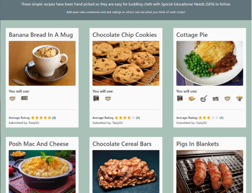

# TasteSENsation

[TasteSENsation](https://tastesensation-pp4-54d01fbc1628.herokuapp.com/) is a recipe site with curated recipes for budding chefs with Special Educational Needs (SEN).

Users are invited to sign up to rate and comment on the recipes so that other visitors to the site can see which recipes are popular. They can also suggest their own recipes to be added to the cookbook recipe list for others to enjoy.

The simple, uncluttered layout and use of additional visual prompts help to make the site easy to understand and navigate with minimal distractions. This means that SEN users are more likely to be able to use the site and follow the steps unaided.

## Features

### Site Wide

***Favicon***
- A favicon with a bold letter 'T' for TasteSENsation so it is easily identifiable among multiple tabs.

***Nav Bar***
- Navigation bar with clear brand heading for TasteSENsation. 
- SEN section of the brand title has different font weight and scale to stand out and reinforce message that this is a recipe site for people with Special Educational Needs (SEN). 
- Includes links for easy navigation around the site. Only links that are accordant with user role and authentication are displayed for better user experience.
- Fully responsive with navigation links collapsable into a burger 'Menu' icon on smaller devices to keep layout clean and uncluttered.
- Includes note to display log in status and username to the user at all times.

***Footer***
- Footer with dark background to frame bottom of html page.
- Includes information on the site designer and links to social media profiles.
- Links open in a new tab for better UK and include aria tags for better accessibility.
- Responsive format to look good on all devices.

***Alert Messages***
- Messages are displayed over the top of the screen to feedback confirmation to the user of certain actions throughout the site.
- Successful confirmation messages are displayed in green to highlight success of the action and provide useful feedback.
- Error messages are displayed in red to highlight that there is something wrong and attention or alternative action is required.
- JavaScript is used to make the messages automatically disappear after 5 seconds for better user experience.
- User can click on 'x' to close the message more quickly if they prefer.

### Recipes Page

***Filter by Rating***
- The user is able to filter the list of recipes so that they can more quickly access recipes with a particular rating such as those that others have enjoyed the most.
- The filter by rating form has the same appearance as the nav bar so that it blends in and appears to be a seamless extension of the nav bar.
- The list of filtered results is displayed with 6 recipes per page. If there are lots of recipes, the filtered recipes continue across multiple pages.
- It is possible for the user to filter the recipes by:
  - 1 star
  - 2 stars
  - 3 stars
  - 4 stars
  - 5 stars
  - Unrated recipes
  - All Recipes

***Banner paragraph***
- Lead paragraph to explain that the recipes displayed in TasteSENsation have been chosen specifically with SEN users in mind.
- Call to action text to highlight features only available to registered users and prompt casual users to sign up and log in.
- Visually clear and simple layout to ensure clarity and keep distractions to a minimum.

***Recipe List***
- Initially all published recipes are displayed, with each recipe featured in a 'recipe card' including:

   - The recipe title (name of the dish). Colour changes to highlight selection and title links to the full recipe details.
   - A recipe image (this is the 'star of the show' and the main focal point for each card). Also links to the full recipe details so user can select either the title or the image to see the full recipe.
   - A 'You will use:' display of icons to represent the different equipment that the recipe requires. This enables users to quickly identify recipes that may not be suitable for SEN ability levels. For example, users may want to look at recipes which include no chopping or hob use.
   - An average rating for the recipe represented by a visual representation of 5 star icons (an aria-label is used to ensure that the average rating is accessible if the user uses a screen reader).
   - The username of the recipe owner (the person who submitted the recipe).

***Pagination***
- The recipe cards are displayed with 6 recipes per page to help manage the flow of information for SEN users who may get easily overwhelmed or distracted with infinite scrolling.
- Using 6 recipe cards also enables more responsive display for the optimum number of cards to be displayed using the grid structure on different devices (rows of 3 cards each on larger screens, 2 cards on tablets and 1 card on small devices). 
- Navigation buttons at the bottom of the page enable the user to view more recipes or go back to previous recipes.
- The page navigation buttons are only visible if there are further pages to view, or if there is a previous page to view.

### Full Recipe Details Page

***Recipe Title***
- Large clear heading at the top of the page to confirm the name of the dish.

***Average Rating and Comment Count***
- Average rating displayed using 5 star icons and coloured representation of the rating.
- Aria label used to ensure that screen readers can announce the rating to users where necessary.
- Rating count indicates total number of ratings for that recipe included in the aggregate average to give better user experience and deeper understanding of the rating context.
- Comment count and comment icon shows the total number of comments for a particular recipe.
- Helps to build interest in the recipe and look at other people's comments. Also provides visual prompt to encourage registered users to leave their own comment.

***Recipe Image***
- The same hero image used for the recipe card in the recipe list for continuity and to confirm the user has selected the right recipe.
- The image size and format type is controlled at the point of creation using Cloudinary functionality so all recipes submitted through the suggest recipe form will feature same sized WEBP image for the hero image.
- Fully responsive image to ensure it looks good on different devices.

***Equipment (You will use:)***
- An equipment list using emoji icon to represent the main items of equipment or skills that will be required for making this recipe.
- The icons enable users to quickly identify recipes that may not be suitable for SEN user abilities or skill level.
- Equipment icons are further explained with the use of figure captions on medium and larger devices. This also ensures that the icons are announced to users who use a screen reader.
- Enables the user to source the equipment that they may need such as a mixing bowl, whisk, colander or chopping board.

***Ingredients (You will need:)***
- A simple list of all ingredients and measurements that are required for making the recipe.
- Located high up on the page alongside the image so that users can source and prepare their ingredients before starting the recipe.

***Instructions***
- A standard subheading highlighted in bold and a different colour for all recipes to remind the user to wash their hands and read through the steps before starting the recipe.
- A step by step ordered list of instructions clearly separated by a horizontal rule to help SEN users to keep track of the step that they are following.
- A checkbox that can be checked off by the user when each step is completed. Further enables the SEN user to maintain focus and keep track of the step that they are on.

***Feedback Section***
- A feedback section for the recipe to enable users to see other people's comments and provide their own feedback.
- Access to the features in this section is controlled through user authentication.
 - **Rate This Recipe** - Registered users are able to provide a star rating for a recipe as long as it was not submitted by themselves. This prevents users from rating their own recipes higher than everyone else's. Casual Users are not able to rate a recipe. Jinja tags are used to check user authentication and check whether there is an existing rating in place for that user. JavaScript is used to add and remove the .hidden class so that the edit rating button and the rating form are only visible for the appropriate user. 
 - **Comments** - Displays all approved comments for this recipe for all users to view. Registered Users are also able to view, edit and delete their own comments that are awaiting approval.
- **Leave a Comment** - Registered Users are able to write and submit their own comments using a simple form. User authentication ensures that Casual Users are not able to submit a comment.

### Suggest Recipe Page and Edit Recipe Page

***Suggest Recipe Form***
- Form created from Recipe database model so that new recipes can be submitted by registered users.
- Once submitted, the user receives a successful submission confirmation message and the recipe is added to the recipe database model to be reviewed by the Superuser for approval.
- User authentication prevents a recipe from being submitted successfully if they are not a registered user and logged in. In this case, an error message notifies the user that they must be logged in to submit a recipe.
- Form includes:
    - Title (Name of dish)
    - Original recipe link (if recipe adapted from a recipe on another site)
    - Featured image field for user to upload a photo of the recipe. This field uses Cloudinary functionality to standardise the image size and set the image format to WEBP.
    - Ingredients section pre-populated with list items 1, 2 and 3 to make it easier for the registered user to edit and add items in the correct list format.
    - Instructions section pre-populated with example steps to update using html code to style in same way as recipes on the site (also adds attributes and aria label to checkbox for validation).
    - Equipment checkboxes to select which key items of equipment and skills will be used when maing this recipe.

***Edit Recipe Form***
- The same recipe form is used to edit a recipe.
- The form is pre-populated with the existing content and the existing recipe image is included so that the user can either select the same one or change it for another one.
- User authentication prevents a recipe from being edited successfully if they are not the recipe owner and logged in. In this case, an error message notifies the user that they must be logged in to edit a recipe.

### Delete Recipe
- JavaScript triggers a delete recipe modal to display if the recipe owner clicks on the 'Delete Recipe' button.
- User authentication prevents the Delete Recipe button from displaying if the person logged in is not the recipe owner.
- User is reminded that this action cannot be undone and that the recipe will lose all comments and ratings once deleted.
- User requested to click on 'Delete' again to confirm action.

## User Authentication

Users are required to sign up and log in to access certain functionality or areas of the TasteSENsation site.

Different user roles are able to view and access different parts of the site.

***Authenticated Access and Functionality by Role***

  | **Functionality**          | **Casual User**| **Reg'd User**|  **Admin**   |
  |:---                        |      :---:     |      :---:    |    :---:     |
  |View Recipes List           |y               |y              |y             |
  |Filter Recipe List by Rating|y               |y              |y             |
  |View Recipe Details         |y               |y              |y             |
  |View Average Rating         |y               |y              |y             |
  |View Approved Comments      |y               |y              |y             |
  |View Own Unapproved Comments|-               |y              |y             |
  |View All Unapproved Comments|-               |-              |y             |
  |                            |                |               |              |
  |Add Rating                  |-               |y              |y             |
  |Edit Own Rating             |-               |y              |y             |                      
  |Edit Other's Ratings        |-               |-              |-             |                      
  |                            |                |               |              |                      
  |Add Comment                 |-               |y              |y             |                      
  |Edit Own Approved Comment   |-               |y              |y             |                      
  |Edit All Approved Comments  |-               |-              |y             |                      
  |Edit Own Unapproved Comment |-               |y              |y             |                     
  |Edit All Unapproved Comments|-               |-              |y             |                      
  |Delete Own Comment          |-               |y              |y             |                      
  |Delete All Comments         |-               |-              |y             |
  |                            |                |               |              |                          
  |Add Recipe                  |-               |y              |y             |                     
  |Edit Own Approved Recipe    |-               |y              |y             |                      
  |Edit All Approved Recipes   |-               |-              |y             |                      
  |Edit Own Unapproved Recipe  |-               |-              |y             |                      
  |Edit All Unapproved Recipes |-               |-              |y             |                      
  |Delete Own Recipe           |-               |y              |y             |                      
  |Delete All Recipes          |-               |-              |y             |
  |                            |                |               |              |    

***Casual User***

TasteSENsation recipes are intended to be accessible to all and some SEN users may not be able to easily provide the details required to register themselves.

Any visitor to the site who is not a registered user or not logged in can view the recipes list and the recipe detail pages so that they can enjoy making the recipe without having to register for the site. This includes viewing the average rating and approved comments, and filtering the recipes by the average rating.

***Registered User***

Users are able to register for the TasteSENsation site via the Sign Up (signup.html) page which is linked in the navigation bar.
Once registered, a user can log in via the Log In (login.html) page whever they visit the site.

Once logged in the registered user will see a note in the nav bar to confirm that they are logged as a specified user. The 'Sign Up' and 'Log In' nav links are then hidden to the user, but 'Suggest Recipe' and 'Log Out' links become visible.

***Admin SuperUser***

*SuperUser login credentials are provided within the Code Institute project submission form.*

When logged in as a SuperUser, you are able to access the admin panel and create, read, update and delete any recipe or comment in the database.

Submitted comments are added to the database for approval, and any unapproved comments are visible to the user who submitted the comment, but are not visible to other users until they have been approved in the admin dashboard. 

This is to ensure that any offensive or inappropriate comments are not visible to potentially vulnerable SEN users.

Comments are approved by ticking the 'Approved' checkbox and saving the comment.

When recipes are submitted via the Suggest Recipe page, these are added to the database, but are not visible in the recipe list until they have been 'Approved' in the admin dashboard. 

This is to ensure design continuity and simplicity in the curated recipes list for SEN users.

Recipes are approved by changing the 'Recipe Approved' status from Submitted to 'Approved' and saving the recipe.

### Existing Features
- Responsive pages with effective styling to look good on different sized devices.
- Robust user authentication ensures that users can only access areas and functionality in accordance with their user role. 
- All form fields are correctly assigned with required or blank=True attributes and clear error messages are displayed to the user if field validation fails.
- This program is deployed and run on Heroku using the CI gitpod template.
- CRUD functionality (Create, Read, Update, Delete) is evident throughout the project. Refer to the CRUD functionality section for further details.

### Future Features

To expand on this project, there are a number of features that could be added to enhance user experience and functionality:
- A user profile page for registered users to track the recipes they have cooked and identify recipes that they would like to try.
- The profile page could include a list of all the comments they have left on other people's recipes.
- Registered users could tag a recipe as a 'favourite' and list these in their profile page.
- Improved functionality for SEN users could include a visual image for each step of the instructions in the recipe detail page. This would further break down each recipe into manageable steps and help the user to understand what is required of them.
- A Further Resources page could provide links to original recipes from other SEN focused cookery / recipe sites and include other useful information and resources.

## Design

### UX Design

Along with more usual UX considerations, TasteSENsation has been designed with SEN users in mind.

Design considerations and features include:
- Simple, uncluttered layout to keep distractions to a minimum and help maintain focus.
- Clear text with good contrast for easy reading.
- Consistent styling with clear instruction for all links and buttons across the site.
- Aria labels used wherever possible to improve accessability for screen reader users.
- Use of visual prompts alongside text. For example: The use of equipment icons as well as figure captions to provide further clarity for SEN users.
- Star icons for average rating and user rating form to provide clear visual understanding, along with aria labels for readers.
- User authentication used to ensure that only links and features that are appropriate for the particular user role are displayed to minimise confusion.
- Clear messaging throughout the site using green success message and red error message styling for clarity.
- Curated recipes with consistent styling throughout to ensure ease of use.
- The use of checkboxes and clear definition between steps to help SEN users to keep track of which step they are on in the recipe instructions.

### CRUD Functionality
Full CRUD (Create, Read, Update, Delete) functionality is evident throughout the site for both Registered Users and Admin SuperUsers.

- Registered Users can:
    - Create a user rating for other people's published recipes
    - Read their own rating in form of star icons on other people's recipes
    - Update their own rating for other people's recipes
    - Create new comments for their own and other people's recipes within the Full Recipe Detail page.
    - Read all approved comments for all recipes, and read their own unnaproved comments awaiting approval. 
    - Read content of own comments in comment form when editing comment.
    - Update their own comments (whether approved or not).
    - Delete their own comments (whether approved or not).
    - Create a new recipe to submit for approval by admin to be added to the site
    - Read all approved (published) recipes, and read content of their own recipe when editing recipe.
    - Update their own recipe as the recipe 'owner' and re-submit for approval
    - Delete their own recipe as the recipe 'owner'

- Admin SuperUsers can:
    - Create, Read, Update and Delete all comments from all users via the admin dashboard
    - Create, Read, Update and Delete all recipes from all users via the admin dashboard

### Agile Methodology

***Trello Board***

- View the live [Trello TasteSENsation Board](https://trello.com/b/vH7TCYBx/tastesensation-your-one-stop-directory-of-user-friendly-sen-accessible-recipes-and-kitchen-skills-training)
- I first created a Trello Board As a starting point for gathering information and mapping out the general idea for TasteSENsation.
- This included the following:
  - TO DO list with a variety of items some of which became EPICS and User Stories later on
  - General Applications to be included in the django project
  - CRUD functionality plans to ensure that this aspect of teh assessment criteria is met
  - Initial UX Design considerations with SEN users in mind
  - Possible Filtering Options to improve the functionality and flexibility for users
  - Source Sites of other SEN focused recipe sites and youtube videos
  - Other Resources list of tutorials, links, Stack Overflow discussions, Django documentation and many others that I used along the way to help with building the project and resolving issues.

***Kanban Board***

- View the live [TasteSENsation Project Kanban Board](https://github.com/users/sophie-thomson/projects/3)
- Following the principles outlined in the Code Institute Agile Working units, I created a GitHub Kanban Board and using Project Issues, Milestones and Labels I mapped out the TasteSENsation project into:
   - EPICS (Overarching blocks of work broken down into USER STORY Issues)
   - To Do (USER STORY issues with acceptance criteria and tasks)
   - In Progress (USER STORY Issues in progress during each Milestone or 'Sprint')
   - Completed (USER STORY Issues that have been completed)
   - BUGS (BUG issues that define a particular issue encountered during the project and how it was resolved)

***MoSCoW***

- Using MoSCoW Prioritisation, each USER STORY and EPIC issue in the kanban board was assigned a label:
   - **Must Have** - High priority Epics, User Stories and Tasks that MUST be included and working in the finished project in order to have a working project and address the Assessment Criteria.
   - **Should Have** - Epics, User Stories and Tasks that SHOULD be included in the project, but that won't cause the project to break and are not required in order to address the assessment criteria.
   - **Could Have** - Epics, User Stories and Tasks that COULD be included in the project, but that are more of a nice to have addition and should not be prioritised over the Must Have or Should Have issues.
   - **Won't Have** - Epics, User Stories and Tasks that WON'T be included in the project. These are issues that would have been nice to include given more time, but do not affect the usability of the project and are not required to address the assessment criteria.
     - EPIC and USER STORY issues that this project Won't Have at the point of submission are:
        - [#9](https://github.com/sophie-thomson/TasteSENsation/issues/9)
        - [#21](https://github.com/sophie-thomson/TasteSENsation/issues/21)
        - [#22](https://github.com/sophie-thomson/TasteSENsation/issues/22)
        - [#25](https://github.com/sophie-thomson/TasteSENsation/issues/25)
        - [#34](https://github.com/sophie-thomson/TasteSENsation/issues/34)
        - [#15](https://github.com/sophie-thomson/TasteSENsation/issues/15)
        - [#23](https://github.com/sophie-thomson/TasteSENsation/issues/23)

***Sprints and Story Points***

- Having broken down each EPIC into USER STORY issues and identified the Must Have priorities, I then split the time I had available until the submission date down into 4-day development 'Sprints' and assigned a date range to each of the Milestones. 
- Estimating that I could work an average of 6hrs per day on my project, I then broke each 'day' into two 'Story Point' blocks of 1-3hrs per block (8 Story Points per Sprint).
- Given my previous experience and my level of understanding and programming skills, I made an estimate of how many Story Point blocks it would take me to complete the tasks for each User Story.
- Arranging each User Story Issue in logical progressional order, I assigned each User Story a certain number of Story Points and a particular Milestone Sprint within which I would aim to complete that set of tasks.
- This approach kept me on track to complete all of the Must Have labelled User Stories required to complete a working project and address the assessment criteria for PP4.

### Design Process

***Wireframes***

- Initial Wireframe designs were used to plan out the layout for the Recipe List and Recipe Detail pages

***Models***

- The next step was to plan and devise an ERD for each of my database models and a schema to map out and understand the relationships between them. I created an ERD and model schema for the project based on all of the elements that I would like to include if I was able (this included the Should Have and Could Have User Story issues).
- As the project progressed it became apparent that would not require all of the models:
    - The 'User model' already existed within the Django framework, so did not require an additional model to be created. 
    - The functionality for the 'Suggestion Model' to create, update and delete recipes could be achieved using methods within the recipe model and views to manipulate the data.
    - Unfortunately I was not going to have time to create a User Profile page for the project at this time.

- I created an ERD for the following models:
  - Recipe Model (Used in final project)
  - Comment Model (Used in final project)
  - Rating Model (Used in final project)
  - User Model (Automatically created in Django framework)
  - Suggestion Model (Not required)
  - Profile Model (Not required)

## Code and Technologies

 The following coding languages, platforms and apps were used in the creation of this site:
 - Django 4.2.16 - Framework used to build the project within.
 - PostgreSQL database created using [CI Database Maker](https://dbs.ci-dbs.net/) is used to store all of the data for TasteSENsation outside of the project.
 - Python - Main programming language used for the back end manipulation and rendering of data and parsing to django templates 
 - HTML - The main language used to build the content of the django templates providing the front end user interface.
 - Bootstrap 5 - Set of pre-defined styles and layouts using a grid structure for building html pages quickly and consistently.
 - CSS - CSS styling is applied to the html templates within the django framework working alongside Bootstrap styling from a static file within the project.
 - JS - Javascript code is applied throughout the site to enable interactive feedback with the user in response to their actions.
 - Cloudinary - Used to store recipe image files externally to the project and render them from a url link instead of a static image file  
 - Gitpod - Cloud development environment used to write and preview code before committing.
 - GitHub - Github hosts the TasteSENsation repository and was used for all version control and agile project management using a kanban board and GitHub issues.
 - [Heroku](https://dashboard.heroku.com/apps) - TasteSENsation is deployed to Heroku as a published project for assessment
 - Font Awesome - Free icons from font awesome are used in the footer and to provide a visual star rating mechanism. 
 - [AI Emoji Creator](https://emojis.sh/) - used to create and download equipment emoji icons used in recipe cards and recipe detail page. 
 - [miro.com](https://miro.com/) - To create database models and model schema
 - Favicon.io - The letter T favicon generated using [Favicon.io](https://favicon.io/favicon-converter/) free generator.
 - Balsamiq - The responsive layout wireframes were designed and planned using [Balsamiq](https://balsamiq.com/).
 - [Trello](https://trello.com/b/vH7TCYBx/tastesensation-your-one-stop-directory-of-user-friendly-sen-accessible-recipes-and-kitchen-skills-training) - Initial planning board to flesh out SEN recipe cookbook idea and requirements.
 

## Testing

### Tests Carried Out
A series of manual tests have been carried out across all aspects of the TasteSENsation site to ensure full working functionality:

- CRUD Functionality - Are registered users able to Create, Read, Update and Delete data in all areas defined in the CRUD Functionality Section of this README? 
- Navigation - Do all links lead to the expected url / information and open in a new page where appropriate?
- User Authentication Testing - Does user authentication manage access and functionality according to user role as expected?
- User Story Testing - Is the project a good solution to the User's needs?

### CRUD Testing

***Rating CRUD Testing for Registered User***

  | **Testing**               |  **Expected Outcome**  | **Actual Outcome**  |
  |:---                       |         :---:          |          :---:      | 
  |Create rating for own recipe? |Message stating "Not permitted to rate own recipe"|Message visible. No add rating option available|
  |Create rating for other's recipe?|Rating Form visible, Submit Rating btn triggers successful submission alert|Form visible and success alert triggered|  
  |If submitted, Read own current rating?| Current Rating shown as star icons with Edit Rating btn visible|Rating shown, Edit Rating btn visible| 
  |Update own rating?|Edit Rating btn shows Rating Form, Edit Rating btn hidden, Submit Rating btn visible,successful submission alert.|All as expected|  
  |Update other's rating?|No current rating displayed and no Edit Rating btn visible|No rating displayed, no Edit Rating btn visible|
  |                           |                        |                     | 

***Comment CRUD Testing for Registered User***

  | **Testing**               |  **Expected Outcome**  | **Actual Outcome**  |
  |:---                       |         :---:          |          :---:      | 
  |Create comment for own recipe?|Comment Form visible and Submit Comment btn triggers successful submission alert|Form visible and success alert triggered|  
  |Create comment for other's recipe?|Comment Form visible and Submit Comment btn triggers successful submission alert|Form visible and success alert triggered| 
  |Read all approved comments for all recipes?|Approved comments visible as a list, or message stating "No comments yet" if none|Comments visible or message visible| 
  |Read all unapproved comments?|Unnaproved comments by other users hidden|Unnapproved commets hidden|  
  |Read own unapproved comments?|Own unnaproved comments visible with note to highlight "Comment awaiting approval"|Own unnaproved comments visible with note|
  |Read own comment in comment form when editing?|Comment content populated in Comment Form when Edit Comment btn clicked|Comment content added to Comment Form|
  |Update own approved comment?|Edit Comment btn visible. Update Comment btn triggers successful submission alert|Form visible and success alert triggered|
  |Delete own approved comment?|Delete Comment btn visible. Delete Comment Modal triggered when clicked. Delete in model triggers success alert|All as expected| 
  |Delete own unapproved comment?|Delete Comment btn visible. Delete Comment Modal triggered when clicked. Delete in model triggers success alert|All as expected|
  |                           |                        |                     | 

***Recipe CRUD Testing for Registered User***

  | **Testing**               |  **Expected Outcome**  | **Actual Outcome**  |
  |:---                       |         :---:          |          :---:      | 
  |Create new recipe using Suggest Recipe page?|Recipe Form visible. Submit Recipe btn triggers success alert.|Form visible and success alert triggered|
  |Create new recipe if not logged in?|If not logged in Submit Recipe btn triggers error alert|Error alert triggered|  
  |Read own recipe in order to update?|If recipe 'Owner', Edit Recipe btn visible and content displayed in Recipe Form for editing|Edit Recipe btn visible, form populated|  
  |Update own recipe using Recipe Form?|If recipe 'Owner', Edit Recipe btn visible (as above) Update Recipe triggers success alert| All as expected|  
  |Update own recipe if not logged in?|If recipe 'Owner', but not logged in Update Recipe btn triggers error alert| Error alert triggered| 
  |Delete own recipe|If recipe 'Owner' Delete Recipe btn visible. Delete Recipe Modal triggered when clicked. Delete in model triggers success alert|All as expected|
  |                           |                        |                     | 

### Navigation Testing

Testing all links and buttons work on each page. Functionality of CRUD related buttons already tested above.

  | **Page Tested**               |  **Expected Outcome**  | **Actual Outcome** 
  |:---                              |      :---:           |      :---:    |
  |Recipe List (index.html)|Recipe links, log in link and page navigation buttons take user to expected url|All as expected|
  |Recipe Detail (recipe_details.html)|Links to log in and sign up pages in feedback section take user to expected url|All as expected|
  |Suggest Recipe (suggest_recipe.html)|No text links to test. Only Submit Recipe btn|All as expected|
  |Edit Recipe (recipe_edit.html)|No text links to test. Only Update Recipe btn|All as expected|
  |Log In (login.html)|Link to Sign Up page takes user to expected url |All as expected|
  |Log Out (logout.html)|No text links to test. Only Log Out btn|All as expected|
  |Sign Up (signup.html)|Link to Log In page takes user to expected url |All as expected|
  |Base Template (base.html)|Nav Bar links and socials links take user to expected url in new page where appropriate|All as expected|
  |       |                |               |

### User Authentication Testing

***User Authentication Testing for Casual Users***

  | **Functionality**          |  **Expected**  | **Actual**   |
  |:---                        |      :---:     |    :---:     |
  |View Recipes List           |y               |y             |
  |Filter Recipe List by Rating|y               |y             |
  |View Recipe Details         |y               |y             |
  |View Average Rating         |y               |y             |
  |View Approved Comments      |y               |y             |
  |View Own Unapproved Comments|-               |-             |
  |View All Unapproved Comments|-               |-             |
  |                            |                |              |
  |Add Rating                  |-               |-             |
  |Edit Own Rating             |-               |-             |
  |Edit Other's Ratings        |-               |-             |
  |                            |                |              |
  |Add Comment                 |-               |-             |                     
  |Edit Own Approved Comment   |-               |-             |
  |Edit All Approved Comments  |-               |-             |
  |Edit Own Unapproved Comment |-               |-             |
  |Edit All Unapproved Comments|-               |-             |
  |Delete Own Comment          |-               |-             |
  |Delete All Comments         |-               |-             |
  |                            |                |              |
  |Add Recipe                  |-               |-             |
  |Edit Own Approved Recipe    |-               |-             |
  |Edit All Approved Recipes   |-               |-             |
  |Edit Own Unapproved Recipe  |-               |-             |                
  |Edit All Unapproved Recipes |-               |-             |                    
  |Delete Own Recipe           |-               |-             |                   
  |Delete All Recipes          |-               |-             |
  |                            |                |              |  

***User Authentication Testing for Registered Users***
  
  | **Functionality**           |  **Expected**  | **Actual**   |
  |:---                         |      :---:     |    :---:     |
  |View Recipes List            |y               |y             |
  |Filter Recipe List by Rating |y               |y             |
  |View Recipe Details          |y               |y             |
  |View Average Rating          |y               |y             |
  |View Approved Comments       |y               |y             |
  |View Own Unapproved Comments |y               |y             |
  |View All Unapproved Comments |-               |-             |
  |                             |                |              |
  |Add Rating to Other's Recipes|y               |y             |
  |Add Rating to Own Recipe     |-               |-             |
  |Edit Own Rating              |y               |y             |
  |Edit Other's Ratings         |-               |-             |
  |                             |                |              |
  |Add Comment                  |y               |y             |                     
  |Edit Own Approved Comment    |y               |y             |
  |Edit All Approved Comments   |-               |-             |
  |Edit Own Unapproved Comment  |y               |y             |
  |Edit All Unapproved Comments |-               |-             |
  |Delete Own Comment           |y               |y             |
  |Delete All Comments          |-               |-             |
  |                             |                |              |
  |Add Recipe                   |y               |y             |
  |Edit Own Approved Recipe     |y               |y             |
  |Edit All Approved Recipes    |-               |-             |
  |Edit Own Unapproved Recipe   |-               |-             |                
  |Edit All Unapproved Recipes  |-               |-             |                    
  |Delete Own Recipe            |y               |y             |                   
  |Delete All Recipes           |-               |-             |
  |                             |                |              |

***User Authentication Testing for Admin Superuser***

  | **Functionality**          |  **Expected**  | **Actual**   |
  |:---                        |      :---:     |    :---:     |
  |View Recipes List           |y               |y             |
  |Filter Recipe List by Rating|y               |y             |
  |View Recipe Details         |y               |y             |
  |View Average Rating         |y               |y             |
  |View Approved Comments      |y               |y             |
  |View Own Unapproved Comments|y               |y             |
  |View All Unapproved Comments|y               |y             |
  |                            |                |              |
  |Add Rating                  |y               |y             |
  |Edit Own Rating             |y               |y             |
  |Edit Other's Ratings        |-               |-             |
  |                            |                |              |
  |Add Comment                 |y               |y             |                     
  |Edit Own Approved Comment   |y               |y             |
  |Edit All Approved Comments  |y               |y             |
  |Edit Own Unapproved Comment |y               |y             |
  |Edit All Unapproved Comments|y               |y             |
  |Delete Own Comment          |y               |y             |
  |Delete All Comments         |y               |y             |
  |                            |                |              |
  |Add Recipe                  |y               |y             |
  |Edit Own Approved Recipe    |y               |y             |
  |Edit All Approved Recipes   |y               |y             |
  |Edit Own Unapproved Recipe  |y               |y             |                
  |Edit All Unapproved Recipes |y               |y             |                    
  |Delete Own Recipe           |y               |y             |                   
  |Delete All Recipes          |y               |y             |
  |                            |                |              |

### User Story Testing

The TasteSENsation site provides a good solution to address USER STORY issues listed in the kanban booard in the following ways:

- Users are able to view a list of recipes in a clean and attractive layout and filter this view accrding to star rating.
- Users are able to view the full details for each recipe and follow a clear set of instructions with checkboxes and clean layout to help them stay on track.
- Users are able to interact with the site by registering and adding their own ratings and comments to feedback on other people's recipes.
- Users are able to submit their own recipe to be added to the cookbook for other people to enjoy.
- Users have full CRUD functionality for their own comments and recipes and are able to update their rating if they change their mind.
 

### Bugs
- Significant issues that took additional research and time to resolve are documented in the [GitHub TasteSENsation Kanban Board](https://github.com/users/sophie-thomson/projects/3). Refer to the relevant BUG issue for further details:
  - [BUG: Initial Deployment to Heroku #35](https://github.com/users/sophie-thomson/projects/3?pane=issue&itemId=80415269&issue=sophie-thomson%7CTasteSENsation%7C35)
  - [BUG: Redefining Recipe Model #39](https://github.com/users/sophie-thomson/projects/3?pane=issue&itemId=81083741&issue=sophie-thomson%7CTasteSENsation%7C39)
  - [BUG: Enabling user to edit star rating #40](https://github.com/users/sophie-thomson/projects/3?pane=issue&itemId=81251658&issue=sophie-thomson%7CTasteSENsation%7C40)
  - [BUG: Handling multiple POST requests in the recipe_detail view #41](https://github.com/users/sophie-thomson/projects/3?pane=issue&itemId=81439675&issue=sophie-thomson%7CTasteSENsation%7C41)
  - [BUG: Casual user not able to view recipe_detail page #42](https://github.com/users/sophie-thomson/projects/3?pane=issue&itemId=81471532&issue=sophie-thomson%7CTasteSENsation%7C42)
  - [BUG: Placeholder comments not showing in Recipe Form #48](https://github.com/users/sophie-thomson/projects/3?pane=issue&itemId=81882211&issue=sophie-thomson%7CTasteSENsation%7C48)
  - [BUG: Edit recipe form showing raw html instead of content #49](https://github.com/users/sophie-thomson/projects/3?pane=issue&itemId=82900515&issue=sophie-thomson%7CTasteSENsation%7C49)
  - [BUG: Equipment icons not responsive #50](https://github.com/users/sophie-thomson/projects/3?pane=issue&itemId=82904254&issue=sophie-thomson%7CTasteSENsation%7C50)
  - [BUG: Filter by star rating not working over pagination logic #53](https://github.com/users/sophie-thomson/projects/3/views/1?pane=issue&itemId=82988924&issue=sophie-thomson%7CTasteSENsation%7C53)
  - [BUG: Suggest Recipe page not responsive on smaller screens #54](https://github.com/users/sophie-thomson/projects/3/views/1?pane=issue&itemId=83097196&issue=sophie-thomson%7CTasteSENsation%7C54)

***Unresolved Bugs / Issues***
- At the time of submission there are some BUG issues that remain unclosed. Details of the approaches tried and the reason they remain unresolved are included in each BUG issue:
  - [BUG: Enabling order by or sort by ranking in RecipeList #51](https://github.com/sophie-thomson/TasteSENsation/issues/51)
  - [BUG: Multiple Validation errors using Summernote Widget #55](https://github.com/sophie-thomson/TasteSENsation/issues/55)
  - [BUG: Validation Errors Issue with AllAuth Signup Form #56](https://github.com/sophie-thomson/TasteSENsation/issues/56)

- There appears to be a console error triggered on the recipe_detail page for the js used to add an event listener to the editRatingBtn to run the showRatingForm function. The error is noted below but the showRatingForm function is working without error, so I am not sure how to go about resolving this error. I have tried moving the Const editRatingBtn variable inside a DOMContentLoaded parameter, but this did not sole the issue. As it is not causing any issues with the functionality I have left this console error unresolved.
  - Console Error: Uncaught TypeError: Cannot read properties of null (reading 'addEventListener') for line 38 of script.js

## Validation

### CI Python Linter
- There are no errors raised in the [Python Linter](https://pep8ci.herokuapp.com/) for any of the TasteSENsation .py files:

### JShint
- JShint flags Bootstrap as an 'Undefined Variable', but as this is used in the walkthrough and is caused by cross referencecing scripts this is not considered an issue.

### HTML

- Known Errors with Summernote Editor Widget. External cause and not solvable using project css.

- Known errors with AllAuth signup form in more recent versions. External cause and not solvable using project css.

### CSS

### Wave Compatibility

### Lighthouse

## Deployment

### Gitpod Version Control
This site was created using the Gitpod cloud development environment before being pushed through to a dedicated repository on Github.

The following commands were used througout development to push the code through to the Github repo:

- **git add .** - This command was used to add any tracked files to the staging area.
- **git commit -m "Commit message."** - This command was used to create a snapshot of the staged area with a short description.
- **git push** - This command was used to push the committed changes from the current branch to the remote repository on Github.

### Deployment

The finished program was initially hosted within a repository on Github, and then this Github repository was connected with Heroku, the site through which the program is deployed.

***How to Deploy to Heroku***

The steps to deploy to Heroku are as follows:

- Ensure that you have a file in your program file directory called: requirements.txt 
- Ensure that all imported libraries that are used in your program are listed in the requirements.txt file.
    - To add any new libraries, type the following command into the terminal: pip3 freeze > requirements.txt
- To avoid errors, ensure that there is a \n (new line) at the end of every input function in your code.
- Use **git add .** then **git commit -m "Commit message."** and then **git push** to push all latest changes into the relevant repository on Github.
- Go to the [Heroku Website](https://dashboard.heroku.com/) and log in by clicking on the link in the top right corner of the screen.
    - Sign up for a new Heroku account if needed. 
    - Please note you will need to add a payment card before Heroku will allow you to deploy any project. 
    - To do this you will need to click on your account profile in the top right corner and click on Account Settings, then select the Billing tab and follow the instructions to add a credit card. 
- Once logged in, click on the **'New'** drop down menu at the top of your dashboard and select **'Create new app'**
- Choose a name for your app ideally using the same conventions as your project name in your Github repository
- Select the region that you are located in from the options shown
- Ignore the Add to pipeline... button and click on **'Create app'**
- Select the **'Settings'** tab at the top of the screen and scroll to the Config Vars section
- ********** Click on **'Reveal Config Vars'** and if you have a file with confidetial information such as a CREDS.json file type 'CREDS' in the 'key' field and then copy the entire contents of your CREDS.json file and paste it all into the 'Value' field before clicking on **'Add'**.
- Repeat the above process to add a second Config Var and type 'PORT' in the 'Key' field and type '8000' in the 'Value' field before clicking on **'Add'**
- *****************
- Scroll back to the top of the page and click on the 'Deploy' tab.
- In the Deployment Method section, select Github and confirm that you want to connect to Github.
- In the 'Search for a repository to connect to' type in the name of the repository that you want to deploy and click **'Search'**.
- Click on the **'Connect'** button next to the correct Github repository in the search results
- Scroll down to select whether you would like to deploy automatically (Heroku will build a new app every time you push new updates through to the Github repository), or whether you would like to deploy manually at less regular intervals when you wish to check or test something.
- Click on **'Deploy Branch'** (ensure that the branch selected is 'main') to deploy manually when you want to.
- Heroku will build your app and will then display a 'View' button at the bottom of the screen.
- Click **'View'** to see your deployed project!

## References
- The CI walkthrough project 'I Think Therefore I Blog' was used as a reference when building the inital project in django and the basis for the recipe and comment models and views.
- [Django documentation](https://docs.djangoproject.com/en/5.1/) - Was used regularly to find potential tags, functions and widgets to manipulate and manage data in Python.
  - [Muliple Choice Fields](https://docs.djangoproject.com/en/5.1/ref/models/fields/)
  - [Generic Views](https://docs.djangoproject.com/en/4.2/ref/class-based-views/generic-display/)
  - [Slugify](https://docs.djangoproject.com/en/5.1/ref/utils/)
  - [Widgets in Forms](https://django.readthedocs.io/en/1.5.x/ref/forms/widgets.html)
  - [Rating count using aggregation](https://docs.djangoproject.com/en/5.1/topics/db/aggregation/)
  - [Adding initial data to a formset](https://docs.djangoproject.com/en/5.1/topics/forms/formsets/#using-initial-data-with-a-formset)
  - [use of Unique_together](https://docs.djangoproject.com/en/5.1/ref/models/options/#django.db.models.Options.unique_together)
- [Bootstrap 5 documentation](https://getbootstrap.com/docs/5.0/getting-started/introduction/) was used regularly when considering layout and styling for the project
- [Stack Overflow](https://stackoverflow.com/) - used as a reference for possible syntax and uses for Star Ratings and Python functions.
- [StackOverflow - Divergent branch issue](https://stackoverflow.com/questions/71768999/how-to-merge-when-you-get-error-hint-you-have-divergent-branches-and-need-to-s)
- [W3 Schools](https://www.w3schools.com/) - used for JS tutorials and testing space to find correct syntax.
- [AllAuth Docs](https://docs.allauth.org/en/latest/installation/quickstart.html)
- [YouTube video tutorial](https://www.youtube.com/watch?v=N-PB-HMFmdo) was used to help resolve issues with pagination for filtered recipe list.
- [YouTube - Adding fields to a Django registration form](https://www.youtube.com/watch?v=TBGRYkzXiTg)
- [Open Classrooms - Using multiple forms on one template](https://openclassrooms.com/en/courses/7107341-intermediate-django/7264795-include-multiple-forms-on-a-page)
- [StackOverflow - Using slugify](https://stackoverflow.com/questions/837828/how-do-i-create-a-slug-in-django)
- [Cloudinary docs](https://cloudinary.com/documentation/resizing_and_cropping)
- [Cloudinary - Resizing cloudinary images in Django](https://support.cloudinary.com/hc/en-us/community/posts/360009752479-How-to-resize-before-uploading-pictures-in-Django)
- [StackOverflow - Adding Summernote to edit recipe form](https://stackoverflow.com/questions/52168446/how-to-use-django-summernote-in-templates)
- [Geek Culture - Implementing a star rating mechanism](https://medium.com/geekculture/django-implementing-star-rating-e1deff03bb1c)
- All recipe images have creative commons licences and were sourced online.
- Slack - Discussions in the CI SLack channels were good for resolving issues including:
  - [Solving Mixed Content Errors](https://code-institute-room.slack.com/archives/C0ZU95T3R/p1724236036607429)
  - Fixing Summernote responsiveness using config settings

SAMPLE TABLE:

  | **Column 1**               |  **Column 2**  | **Column 3**  | **Column 4** |  **Column 5**      |
  |:---                        |      :---:     |      :---:    |    :---:     |        :---:       |
  |                            |                |               |              |                    |
  |                            |                |               |              |                    |
  |                            |                |               |              |                    |
  |                            |                |               |              |                    |
  |                            |                |               |              |                    |
  |                            |                |               |              |                    |
  |                            |                |               |              |                    |

